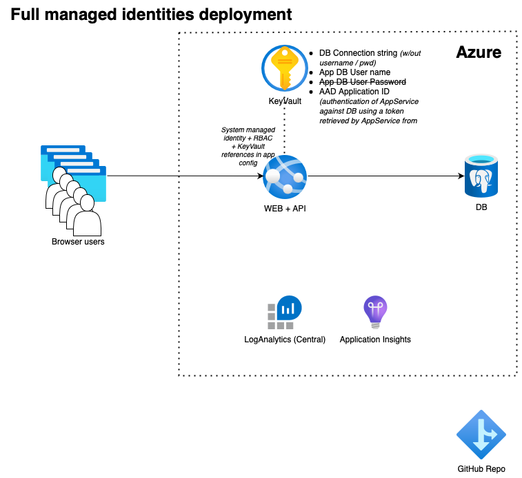

# Spring Boot Todo App on App Service
## Deployment with full managed identities usage (Bicep)



* Start the command line, clone the repo using ```git clone https://github.com/martinabrle/tiny-java.git``` and change your current directory to ```tiny-java/scripts``` directory:
    ```
    cd ./tiny-java/scripts
    ```
* Log in into Azure from the command line using ```az login``` ([link](https://docs.microsoft.com/en-us/cli/azure/authenticate-azure-cli))
* List available Azure subscriptions using ```az account list -o table``` ([link](https://docs.microsoft.com/en-us/cli/azure/account#az-account-list))
* Select an Azure subscription to deploy the infra into, using ```az account set -s 00000000-0000-0000-0000-000000000000```
  ([link](https://docs.microsoft.com/en-us/cli/azure/account#az-account-set)); replace ```00000000-0000-0000-0000-000000000000``` with Azure subscription Id you will deploy into
* Set environment variables:
    ```
    export AZURE_LOG_ANALYTICS_WRKSPC_NAME="{{{REPLACE_WITH_LOG_WORKSPACE_NAME}}}"
    export AZURE_LOG_ANALYTICS_WRKSPC_RESOURCE_GROUP="{{{REPLACE_WITH_LOG_WORKSPACE_RESOURCE_GROUP}}}"
    export ENV_PREFIX="{{{REPLACE_WITH_DEPLOYMENT_PREFIX}}}"
    ```

    ```
    export AZURE_DBA_GROUP_NAME="All TEST PGSQL Admins"
    export AZURE_DBA_GROUP_ID=`az ad group show --group "All TEST PGSQL Admins" --query '[id]' -o tsv`

    export AZURE_RESOURCE_GROUP=${ENV_PREFIX}-tinyjava-app-svc_rg
    export AZURE_LOCATION=eastus
    export AZURE_KEY_VAULT_NAME=${ENV_PREFIX}-tinyjava-app-svc-kv
    export AZURE_APP_INSIGHTS_NAME=${ENV_PREFIX}-tinyjava-app-svc-ai
    export AZURE_DB_SERVER_NAME=${ENV_PREFIX}-tinyjava-app-svc-pg
    export AZURE_DB_NAME=tododb
    export dbAdminName="a`openssl rand -hex 5`"
    export dbAdminPassword="`openssl rand -base64 25`#@"
    export AZURE_DB_APP_USER_NAME="u`openssl rand -hex 5`"
    export AZURE_APP_NAME=${ENV_PREFIX}-tinyjava-app-svc
    export AZURE_APP_PORT=443
    export clientIPAddress=`dig +short myip.opendns.com @resolver1.opendns.com.`
    export createDB=true
    export AZURE_RESOURCE_TAGS="{ 'Department': 'RESEARCH', 'CostCentre': 'DEV', 'DeleteNightly': 'true',  'DeleteWeekly': 'true'}"
    export RESOURCE_TAGS='{ \"Department\": \"RESEARCH\", \"CostCentre\": \"DEV\", \"DeleteNightly\": \"true\",  \"DeleteWeekly\": \"true\"}'

    echo "-------------------"
    echo "Save for later use:"
    echo "-------------------"
    echo "DB Admin: ${dbAdminName}"
    echo "DB Admins password: ${dbAdminPassword}"
    echo "DB App user: ${AZURE_DB_APP_USER_NAME}"
    ```
* If it there is no existing Log Analytics Workspace in a region you are deploying into, create a new resource group and a new Log Analytics Workspace in it:
    ```
    az group create -l $AZURE_LOCATION -g $AZURE_LOG_ANALYTICS_WRKSPC_RESOURCE_GROUP

    az monitor log-analytics workspace create -g $AZURE_LOG_ANALYTICS_WRKSPC_RESOURCE_GROUP --workspace-name $AZURE_LOG_ANALYTICS_WRKSPC_RESOURCE_GROUP
    ```

* Create a new resource group:
    ```
    az deployment sub create \
            --l $AZURE_LOCATION \
            --template-file ./templates/components/rg.bicep \
            --parameters name=$AZURE_RESOURCE_GROUP location=$AZURE_LOCATION resourceTags="$AZURE_RESOURCE_TAGS"
    ```   
* Initial deployment (only creates an AppService in order to be able to use a SystemAssignedIdentity later on):
    ```
    az deployment group create \
        --resource-group $AZURE_RESOURCE_GROUP \
        --template-file ./templates/app-service-mi-init.bicep \
        --parameters appServiceName=$AZURE_APP_NAME \
                     appServicePort=$AZURE_APP_PORT
    ```
* Deploy all services:
    ```
    az deployment group create \
        --resource-group $AZURE_RESOURCE_GROUP \
        --template-file ./templates/app-service-mi.bicep \
        --parameters logAnalyticsWorkspaceName=$AZURE_LOG_ANALYTICS_WRKSPC_NAME \
                     logAnalyticsWorkspaceRG=$AZURE_LOG_ANALYTICS_WRKSPC_RESOURCE_GROUP \
                     appInsightsName=$AZURE_APP_INSIGHTS_NAME  \
                     keyVaultName=$AZURE_KEY_VAULT_NAME  \
                     dbServerName=$AZURE_DB_SERVER_NAME \
                     dbName=$AZURE_DB_NAME \
                     createDB=true \
                     dbAdminName=$dbAdminName \
                     dbAdminPassword=$dbAdminPassword \
                     dbUserName=$AZURE_DB_APP_USER_NAME@$AZURE_DB_SERVER_NAME \
                     appServiceName=$AZURE_APP_NAME \
                     appServicePort=$AZURE_APP_PORT \
                     deploymentClientIPAddress=$clientIPAddress
    ```
* Assign a newly created appservice's AppId to a variable:
    ```
    export DB_APP_USER_ID=`az ad sp list --display-name $AZURE_APP_NAME --query "[?displayName=='${AZURE_APP_NAME}'].appId" --out tsv`
    ```
* Assign AAD DBA group to the newly created Postgresql server:
    ```
    az postgres server ad-admin create -s $AZURE_DB_SERVER_NAME -g $AZURE_RESOURCE_GROUP --object-id $AZURE_DBA_GROUP_ID --display-name "${AZURE_DBA_GROUP_NAME}"
    ```
* Log-in into the newly created Postgresql server as an AAD admin user (assuming the current user is a member of the DBA group):
    ```
    export PGPASSWORD=`az account get-access-token --resource-type oss-rdbms --query "[accessToken]" --output tsv`
    psql --set=sslmode=require -h ${AZURE_DB_SERVER_NAME}.postgres.database.azure.com -p 5432 -d postgres -U "${AZURE_DBA_GROUP_NAME}@${AZURE_DB_SERVER_NAME}"
    ```
* Initialize DB schema:
    ```
    CREATE TABLE IF NOT EXISTS todo (
        "id" UUID DEFAULT gen_random_uuid() PRIMARY KEY NOT NULL,
        "todo_text" VARCHAR(255) NOT NULL,
        "created_date_time" TIMESTAMP DEFAULT NOW()::date,
        "completed_date_time" TIMESTAMP DEFAULT NULL
    );
    ```
* Create AAD DB user and assign their permissions:
    ```
    SET aad_validate_oids_in_tenant=off;
    CREATE ROLE ${DB_APP_USER_NAME} WITH LOGIN PASSWORD '${DB_APP_USER_ID}' IN ROLE azure_ad_user;
    GRANT CONNECT ON DATABASE ${AZURE_DB_NAME} TO ${DB_APP_USER_NAME};
    GRANT USAGE ON SCHEMA public TO ${DB_APP_USER_NAME};
    ```
* Change your current directory to ```tiny-java/todo```:
    ```
    cd ../todo
    ```
* Build the app using ```./mvnw clean``` and ```./mvnw build```
* Configure the application with Maven Plugin by running ```./mvnw com.microsoft.azure:azure-webapp-maven-plugin:2.2.0:config```. This maven goal will first authenticate with Azure and than it will ask you which App Service (or in other words, which Java WebApp) do you want to deploy the app into. Confirm the selection and you will find an updated configuration in the project's ```pom.xml```.
* Deploy the application by running ```./mvnw azure-webapp:deploy```
* Open the app's URL (```https://${AZURE_APP_NAME}.azurewebsites.net/```) in the browser and test it by creating and reviewing tasks
* Explore the SCM console on (```https://${AZURE_APP_NAME}.scm.azurewebsites.net/```); check logs and bash
* Review an AppService configuration to see that no App Password is being used
* Delete previously created resources using ```az group delete -n $AZURE_RESOURCE_GROUP``` ([link](https://docs.microsoft.com/en-us/cli/azure/group?view=azure-cli-latest#az-group-delete))
* If you created a new Log Analytics Workspace, delete it using  ```az group delete -n $AZURE_LOG_ANALYTICS_WRKSPC_RESOURCE_GROUP``` ([link](https://docs.microsoft.com/en-us/cli/azure/group?view=azure-cli-latest#az-group-delete))
