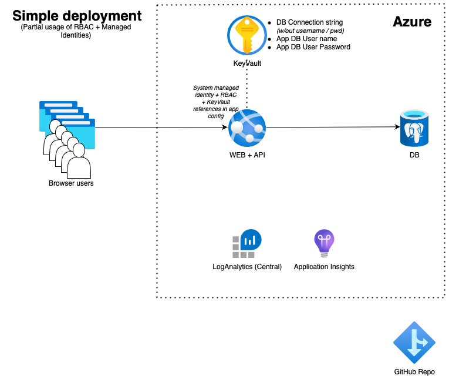

# Spring Boot Todo App on Container Instance
## Simplified deployment with partial managed identities usage (Bicep)



* Start the command line, clone the repo using ```git clone https://github.com/martinabrle/tiny-java.git``` and change your current directory to ```tiny-java/scripts``` directory:
    ```
    cd ./tiny-java/scripts
    ```
* Log in into Azure from the command line using ```az login``` ([link](https://docs.microsoft.com/en-us/cli/azure/authenticate-azure-cli))
* List available Azure subscriptions using ```az account list -o table``` ([link](https://docs.microsoft.com/en-us/cli/azure/account#az-account-list))
* Select an Azure subscription to deploy the infra into, using ```az account set -s 00000000-0000-0000-0000-000000000000```
  ([link](https://docs.microsoft.com/en-us/cli/azure/account#az-account-set)); replace ```00000000-0000-0000-0000-000000000000``` with Azure subscription Id you will deploy into
* Set environment variables:
    ```
    TODO: implement
    ```

 