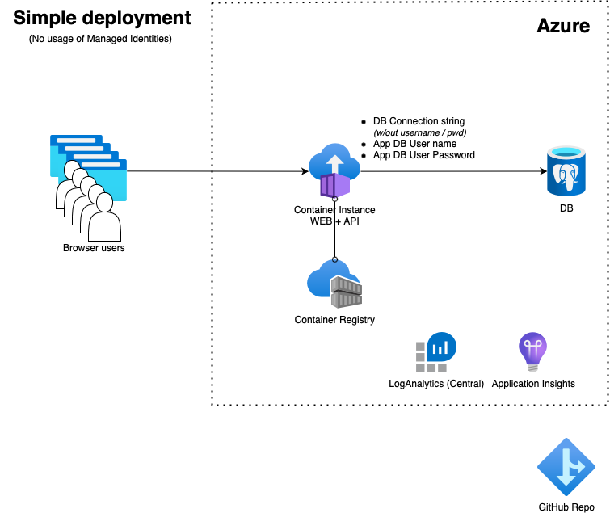

# Spring Boot Todo App on Container Instance
## Simplified deployment without managed identities usage (Bicep)



* Start the command line, clone the repo using ```git clone https://github.com/martinabrle/tiny-java.git``` and change your current directory to ```tiny-java/scripts``` directory:
    ```
    cd ./tiny-java/scripts
    ```

* Log in into Azure from the command line using ```az login``` ([link](https://docs.microsoft.com/en-us/cli/azure/authenticate-azure-cli))

* List available Azure subscriptions using ```az account list -o table``` ([link](https://docs.microsoft.com/en-us/cli/azure/account#az-account-list))

* Select an Azure subscription to deploy the infra into, using ```az account set -s 00000000-0000-0000-0000-000000000000```
  ([link](https://docs.microsoft.com/en-us/cli/azure/account#az-account-set)); replace ```00000000-0000-0000-0000-000000000000``` with Azure subscription Id you will deploy into

* Set environment variables:
    ```
    export AZURE_LOG_ANALYTICS_WRKSPC_NAME="{{{REPLACE_WITH_LOG_WORKSPACE_NAME}}}"
    export AZURE_LOG_ANALYTICS_WRKSPC_RESOURCE_GROUP="{{{REPLACE_WITH_LOG_WORKSPACE_RESOURCE_GROUP}}}"
    export ENV_PREFIX="{{{REPLACE_WITH_DEPLOYMENT_PREFIX}}}"
    ```

    ```
    export AZURE_SUBSCRIPTION_ID=`az account show --query "[id]" -o tsv`

    export AZURE_RESOURCE_GROUP=${ENV_PREFIX}-tinyjava-container-instance_rg
    export AZURE_LOCATION=eastus
    export AZURE_KEY_VAULT_NAME=${ENV_PREFIX}-tinyjava-ci-kv
    export AZURE_APP_INSIGHTS_NAME=${ENV_PREFIX}-tinyjava-ci-ai
    export AZURE_DB_SERVER_NAME=${ENV_PREFIX}-tinyjava-ci-pg
    export AZURE_DB_NAME=tododb
    export dbAdminName="a`openssl rand -hex 5`"
    export dbAdminPassword="`openssl rand -base64 25`#@"
    export AZURE_DB_APP_USER_NAME="u`openssl rand -hex 5`"
    export AZURE_DB_APP_USER_PASSWORD="p`openssl rand -base64 25`#@"
    export AZURE_CONTAINER_REGISTRY_NAME=${ENV_PREFIX}tinyjavareg
    export AZURE_CONTAINER_INSTANCE_NAME=${ENV_PREFIX}-tinyjava-ci
    export AZURE_CONTAINER_APP_NAME=${ENV_PREFIX}-tinyjava
    export CONTAINER_NAME_ACI_HELLO_WORLD='http://mcr.microsoft.com/azuredocs/aci-helloworld'
    export AZURE_APP_PORT=443
    export clientIPAddress=`dig +short myip.opendns.com @resolver1.opendns.com.`
    export AZURE_RESOURCE_TAGS="{ 'Department': 'RESEARCH', 'CostCentre': 'DEV', 'DeleteNightly': 'true',  'DeleteWeekly': 'true'}"
    export AZURE_CONTAINER_INSTANCE_IDENTITY_NAME="${AZURE_CONTAINER_INSTANCE_IDENTITY_NAME}"
    export AZURE_CONTAINER_INSTANCE_DNS_LABEL=`echo "${AZURE_CONTAINER_INSTANCE_NAME}" | tr -d '-' | tr -d '_'`;

    echo "-------------------"
    echo "Save for later use:"
    echo "-------------------"
    echo "DB Admin: ${dbAdminName}"
    echo "DB Admins password: ${dbAdminPassword}"
    echo "DB App user: ${AZURE_DB_APP_USER_NAME}"
    ```

* If it there is no existing Log Analytics Workspace in a region you are deploying into, create a new resource group and a new Log Analytics Workspace in it:
    ```
    az group create -l $AZURE_LOCATION -g $AZURE_LOG_ANALYTICS_WRKSPC_RESOURCE_GROUP

    az monitor log-analytics workspace create -g $AZURE_LOG_ANALYTICS_WRKSPC_RESOURCE_GROUP --workspace-name $AZURE_LOG_ANALYTICS_WRKSPC_RESOURCE_GROUP
    ```

* Create a new resource group:
    ```
    az deployment sub create \
            --l $AZURE_LOCATION \
            --template-file ./templates/components/rg.bicep \
            --parameters name=$AZURE_RESOURCE_GROUP location=$AZURE_LOCATION resourceTags="$AZURE_RESOURCE_TAGS"
    ```   

* Initial deployment (only creates a Container Instance in order to be able to use a SystemAssignedIdentity later on):
    ```
    az deployment group create \
        --resource-group $AZURE_RESOURCE_GROUP \
        --template-file ./templates/container-instance-mi-init.bicep \
        --parameters containerInstanceName=${AZURE_CONTAINER_INSTANCE_NAME} \
                     containerInstanceIdentityName="${AZURE_CONTAINER_INSTANCE_NAME}identity" \
                     containerAppName=${AZURE_CONTAINER_APP_NAME} \
                     containerAppPort=${AZURE_APP_PORT} 
    ```

* Deploy all services (referencing the hello-world container here for the first deployment):
    ```
    az deployment group create \
        --resource-group $AZURE_RESOURCE_GROUP \
        --template-file ./templates/container-instance-classic.bicep \
        --parameters location=${AZURE_LOCATION}  \
                     logAnalyticsWorkspaceName=${AZURE_LOG_ANALYTICS_WRKSPC_NAME}  \
                     logAnalyticsWorkspaceRG=${AZURE_LOG_ANALYTICS_WRKSPC_RESOURCE_GROUP}  \
                     appInsightsName=${AZURE_APP_INSIGHTS_NAME}  \
                     dbServerName=${AZURE_DB_SERVER_NAME} \
                     dbName=${AZURE_DB_NAME} \
                     createDB=true \
                     dbAdminName=${dbAdminName} \
                     dbAdminPassword=${dbAdminPassword} \
                     dbUserName=${AZURE_DB_APP_USER_NAME} \
                     dbUserPassword=${AZURE_DB_APP_USER_Password} \
                     containerRegistryName=${AZURE_CONTAINER_REGISTRY_NAME} \
                     containerInstanceName=${AZURE_CONTAINER_INSTANCE_NAME} \
                     containerAppName=${AZURE_CONTAINER_APP_NAME} \
                     containerAppPort=${AZURE_APP_PORT} \
                     containerImageName="${CONTAINER_NAME_ACI_HELLO_WORLD}"  \
                     deploymentClientIPAddress=$clientIPAddress
    ```

* Connect to the the newly created Postgresql database:
    ```
    psql "host=${AZURE_DB_SERVER_NAME}.postgres.database.azure.com port=5432 dbname=${AZURE_DB_NAME} user=${AZURE_DB_APP_USER_NAME}@${AZURE_DB_SERVER_NAME} password=${dbAdminPassword} sslmode=require"
    ```

* Initialize DB schema:
    ```
    CREATE TABLE IF NOT EXISTS todo (
        "id" UUID DEFAULT gen_random_uuid() PRIMARY KEY NOT NULL,
        "todo_text" VARCHAR(255) NOT NULL,
        "created_date_time" TIMESTAMP DEFAULT NOW()::date,
        "completed_date_time" TIMESTAMP DEFAULT NULL
    );
    ```

* Create an App DB user and assign their rights:
    ```
    CREATE USER ${AZURE_DB_APP_USER_NAME} WITH PASSWORD '${AZURE_DB_APP_USER_PASSWORD}';
    GRANT CONNECT ON DATABASE tododb TO ${AZURE_DB_APP_USER_NAME};
    GRANT USAGE ON SCHEMA public TO ${AZURE_DB_APP_USER_NAME};
    GRANT SELECT ON todo TO ${AZURE_DB_APP_USER_NAME};
    GRANT INSERT ON todo TO ${AZURE_DB_APP_USER_NAME};
    ```

* Change your current directory to ```tiny-java/todo```:
    ```
    cd ../todo
    ```

* Build the application using a multi-stage Docker container file and push it into the newly created container registry
    ```
    az acr build ./ -t tiny-java:1.0.1 -r ${AZURE_CONTAINER_REGISTRY_NAME}.azurecr.io --build-arg VERSION=1.0.1
    ```

* Use ``` az container create ``` to deploy a container image into the container instance. This can be done using var. other methods - even by redeploying the bicep template above.
    ```
    AZURE_APP_INSIGHTS_CONNECTION_STRING=`az resource show -n $AZURE_APP_INSIGHTS_NAME -g $AZURE_RESOURCE_GROUP --resource-type Microsoft.Insights/components --query "[properties.ConnectionString]" -o tsv`
    AZURE_APP_INSIGHTS_INSTRUMENTATION_KEY=`"az resource show -n $AZURE_APP_INSIGHTS_NAME -g $AZURE_RESOURCE_GROUP --resource-type Microsoft.Insights/components --query "[properties.InstrumentationKey]" -o tsv`

    az container create --location $AZURE_LOCATION \
                        --resource-group $AZURE_RESOURCE_GROUP \
                        --acr-identity "/subscriptions/${AZURE_SUBSCRIPTION_ID}/resourcegroups/${AZURE_RESOURCE_GROUP}/providers/Microsoft.ManagedIdentity/userAssignedIdentities/${AZURE_CONTAINER_INSTANCE_IDENTITY_NAME}" \
                        --assign-identity [system] "/subscriptions/${AZURE_SUBSCRIPTION_ID}/resourcegroups/${AZURE_RESOURCE_GROUP}/providers/Microsoft.ManagedIdentity/userAssignedIdentities/${AZURE_CONTAINER_INSTANCE_IDENTITY_NAME}" \
                        --cpu 1 \
                        --memory 1 \
                        --dns-name-label "${AZURE_CONTAINER_INSTANCE_DNS_LABEL}" \
                        --environment-variables APPINSIGHTS_INSTRUMENTATIONKEY="${AZURE_APP_INSIGHTS_INSTRUMENTATION_KEY}" \
                                                APPLICATIONINSIGHTS_CONNECTION_STRING="${AZURE_APP_INSIGHTS_CONNECTION_STRING}" \
                                                SPRING_DATASOURCE_URL="jdbc:postgresql://${AZURE_DB_SERVER_NAME}.postgres.database.azure.com:5432/${AZURE_DB_NAME}" \
                                                SPRING_DATASOURCE_USERNAME="${AZURE_DB_APP_USER_NAME}" \
                                                SPRING_DATASOURCE_PASSWORD="${AZURE_DB_APP_PASSWORD}" \
                                                SPRING_PROFILES_ACTIVE="test" \
                                                PORT=80 \
                                                SPRING_DATASOURCE_SHOW_SQL=true \
                        --image "${AZURE_CONTAINER_REGISTRY_NAME}.azurecr.io/tiny-java:1.0.1" \
                        --ip-address Public \
                        --log-analytics-workspace $AZURE_LOG_ANALYTICS_WRKSPC_NAME \
                        --name $AZURE_CONTAINER_INSTANCE_NAME \
                        --os-type Linux \
                        --ports $AZURE_APP_PORT

* Explore Container logs on *Container instance -> Containers -> Logs* to see the log output

* Use shell on *Container instance -> Containers -> Connect* to remote into the container and poke around

* Review an *Container instance -> Containers -> Environment* configuration to see that no App Password is being used

* Open the app's URL (```http://${AZURE_CONTAINER_INSTANCE_DNS_LABEL}.${AZURE_LOCATION}.azurecontainer.io/```) in the browser and test it by creating and reviewing tasks

* Delete previously created resources using ```az group delete -n $AZURE_RESOURCE_GROUP``` ([link](https://docs.microsoft.com/en-us/cli/azure/group?view=azure-cli-latest#az-group-delete))

* If you created a new Log Analytics Workspace, delete it using  ```az group delete -n $AZURE_LOG_ANALYTICS_WRKSPC_RESOURCE_GROUP``` ([link](https://docs.microsoft.com/en-us/cli/azure/group?view=azure-cli-latest#az-group-delete))
